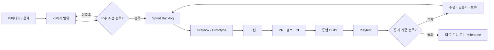
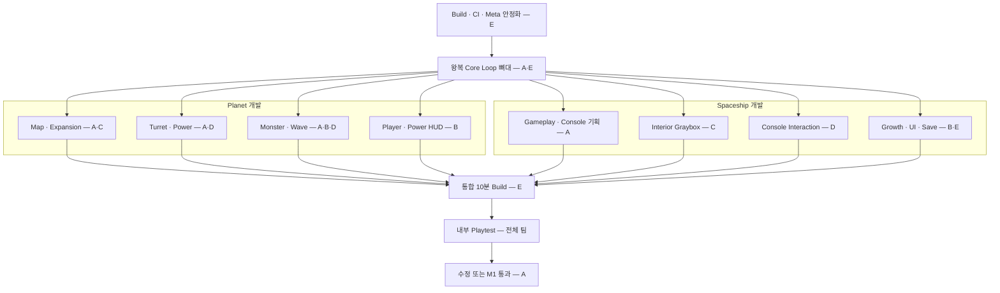

# The Developer — 전체 개발 흐름

상태: 사용 중
관리: PL
수정일: 2026-09-10

이 문서는 팀의 전체 개발 순서를 정의하는 실행 기준이다. 무엇을 만들지는 `PROJECT_PLAN.md`, 현재 할 일은 `SPRINT_0_BACKLOG.md`, 협업 규칙은 `TEAM_WORKFLOW.md`에서 관리한다.

## 1. 전체 흐름 한 줄 요약

> 기획 확정 → Graybox → 핵심 Prototype → 통합 Build → Playtest → 통과 판정 → Content 제작 → 완성도 개선 → 출시



핵심 원칙은 `완성품을 오래 만든 뒤 처음 합치는 방식`이 아니라, 작은 실행 가능 Build를 빠르게 만들고 검증 결과에 따라 다음 작업을 결정하는 것이다.

## 2. 문서별 책임

| 질문 | 확인할 문서 | 갱신 책임 |
|---|---|---|
| 우리 게임은 무엇인가? | `PROJECT_PLAN.md` | PL |
| 지금 어느 Milestone이고 다음 통과 기준은 무엇인가? | `DEVELOPMENT_FLOW.md`와 `PROJECT_PLAN.md` | PL |
| 이번 Sprint에 무엇을 끝내는가? | 현재 Sprint Backlog | PL + 기능 담당자 |
| 구현과 Merge는 어떤 규칙으로 하는가? | `TEAM_WORKFLOW.md` | 통합 담당자 |
| 새 아이디어를 지금 넣어도 되는가? | Product Backlog와 Decision Log | PL 승인 |

회의 내용, 채팅, 개인 메모는 결정의 근거일 수 있지만 공식 기준은 아니다. 승인된 결정은 반드시 위 문서 중 한 곳에 반영한다.

## 3. 전체 개발 단계

| 순서 | 예상 기간 | 목표 | 통과 증거 | 통과 전 금지 |
|---|---:|---|---|---|
| Sprint 0 / M0 | 1주 | 프로젝트 안정화와 기획 확정 | Build·CI 성공, Map/Hub Graybox 승인, 역할표와 범위 승인 | 새 Planet, Final Art, Online |
| Sprint 1 / M1 | 2주 | 10분 핵심 Prototype | Hub → Planet → 전투 → 귀환을 5회 연속 완주 | Content 대량 생산 |
| M2 / 2~3 Sprints | 4~6주 | Planet 1 Vertical Slice | 외부 Playtest와 품질 기준 통과 | Planet 2 착수 |
| M3 / 1 Sprint | 2주 | 반복 제작 구조 확립 | Code 수정 없이 새 Graybox Planet 제작 가능 | 반복적인 수작업 Content 제작 |
| M4 Alpha | 범위 승인 후 | 예정 Content 전체 실행 가능 | 처음부터 끝까지 완주 가능 | 새 핵심 기능 |
| M5 Beta | 3~4주 | Balance, UX, 성능, Bug 수정 | Crash·Major Bug 0 | 기능 추가 |
| M6 출시 후보 Build | 1~2주 | 배포 가능한 Final Build | 새 설치, Save, License 검증 | 검증 없는 변경 |

Sprint 0만 프로젝트 정비를 위한 `1주 예외 Sprint`다. Sprint 1부터는 기본적으로 2주 단위를 사용한다. 날짜가 지나도 통과 기준(Exit Criteria)을 충족하지 못하면 다음 Milestone으로 넘어가지 않는다.

## 4. 현재 작업의 선행 관계

역할은 개발 영역에 따라 나눈다. Planet에서는 `A: Map·Content`, `B: Player·Wave·HUD`, `C: Environment`, `D: Enemy AI·Turret/Power`, `E: Stage 연결·Build`를 맡는다. Spaceship에서는 `A: Gameplay 기획`, `B: Growth·UI`, `C: Interior`, `D: Interaction`, `E: Mission·Save·Scene 연결`을 맡는다. 자세한 표와 Code Review 조합은 `TEAM_WORKFLOW.md`를 따른다.



각 분야는 병렬로 진행하되 서로 주고받을 값과 연결 방식부터 합의한다.

- Planet Map: Sector ID, 개방 상태, Spawn Point, Turret Slot
- Planet 전투: Turret 활성화와 Power, Monster 역할과 Wave, Player 전투
- Spaceship 공간: 방 배치, 이동 동선, Console 위치
- Spaceship 기능: Mission 선택, Growth, 출격, 결과, 귀환, Save
- UI: 각 System의 상태를 보여주되 Gameplay Rule 자체는 담당하지 않음

기능끼리 직접 참조를 임의로 늘리지 않는다. 필요한 Data와 Event는 기능 담당자와 통합 담당자가 먼저 연결 규칙을 정한다.

## 5. Sprint 운영 순서

### A. Backlog 정리 — Sprint 계획 전

PL과 기능 담당자가 Sprint 후보 Task를 준비한다.

- 해결할 Player 문제와 기대 효과
- 포함 범위 / 제외 범위
- 담당자, 예상 시간, 선행 작업
- 완료 조건과 확인 방법
- 영향받는 Scene, Prefab, Code Module

위 항목이 없으면 `Ready`가 아니며 Sprint에 넣지 않는다.

### B. Sprint 계획 — 첫날

1. 최신 통합 Build를 직접 실행한다.
2. 현재 Milestone의 가장 큰 위험 요소 한 가지를 고른다.
3. Sprint Goal을 한 문장으로 정한다.
4. Goal에 직접 연결된 Task만 선택한다.
5. 각 팀원은 동시에 최대 1개의 주 Task와 1개의 작은 Task만 맡는다.
6. 개인 가용 시간의 70%만 계획하고 나머지는 통합과 Bug 수정에 남긴다.

### C. 구현 — Sprint 전반

1. Feature Branch 생성
2. 가장 작은 Graybox 또는 Test Case로 동작 증명
3. 핵심 Logic 구현
4. 다른 기능과 연결하기 전에 Local Test
5. 하루 이상 막히면 `Blocked`로 표시하고 도움 요청
6. 완성될 때까지 기다리지 말고 작은 단위로 PR 생성

### D. 중간 통합 — Sprint 중간점

- 완료된 기능을 `main`에 합친다.
- Scene 흐름과 Core Loop를 직접 실행한다.
- 선행 작업 변경과 충돌을 확인한다.
- Goal과 관계없는 작업은 Product Backlog로 돌린다.
- 남은 작업 시간으로 Sprint 목표를 달성할 수 없으면 범위를 줄인다.

### E. Build 검토와 Playtest — 주 1회

1. 개인 Editor 화면이 아니라 동일한 통합 Build를 사용한다.
2. 자신이 만들지 않은 기능을 최소 한 명이 Test한다.
3. Bug는 재현 순서, 기대 결과, 심각도를 기록한다.
4. Playtest 질문으로 이해도와 선택 변화를 확인한다.
5. 다음 Build에서 반드시 고칠 최대 세 가지를 정한다.

### F. Sprint 검토와 회고 — 마지막 날

- `Done`은 시연 여부가 아니라 Task의 완료 조건과 팀의 공통 완료 기준으로 판정한다.
- 미완료 Task는 자동 연장하지 않고 원인을 확인한 뒤 재계획한다.
- Sprint 목표 달성 여부와 Milestone 통과 기준의 변화를 기록한다.
- 작업 방식의 문제 한 가지와 다음 Sprint에서 바꿀 행동 한 가지만 정한다.

## 6. Task 상태 흐름

| 상태 | 의미 | 다음 상태로 가는 조건 |
|---|---|---|
| Idea | 아직 검토하지 않은 제안 | 해결할 문제와 효과 기록 |
| Backlog | 언젠가 할 수 있으나 현재 약속하지 않은 일 | 우선순위와 Milestone 연결 |
| Ready | 구현에 필요한 정보가 준비된 일 | Sprint 계획에서 선택 |
| In Progress | 담당자가 작업 중 | Local Test와 스스로 검토 완료 |
| Review | PR 검토 중 | 검토 승인과 CI 성공 |
| Integrated | `main`에서 다른 기능과 함께 동작 | 통합 Build Test 성공 |
| Verify | Playtest 또는 완료 조건 확인 중 | 조건 충족 |
| Done | 검증까지 완료 | 없음 |
| Blocked | 외부 결정이나 선행 작업 때문에 진행 불가 | 해결 담당자와 예정 시점 지정 |

`코드를 작성함`, `내 PC에서 한 번 동작함`, `PR을 올림`은 Done이 아니다.

## 7. 기능 하나를 만드는 표준 순서

예: Laser Turret을 추가하는 경우

1. **기능 정의** — 역할, Power Cost, 강점, 약점, 대응 Monster 정의
2. **연결 규칙 합의** — Shared Turret API와 필요한 Data/Event 결정
3. **Graybox** — 임시 Visual로 Targeting, Damage, 활성화 검증
4. **구현** — Gameplay Code와 Data 연결
5. **Local Test** — ON/OFF, Power 반환, Wave 종료, Scene 재시작 확인
6. **PR & CI** — Code Review, `.meta`, 깨진 참조, Build 확인
7. **통합** — HUD, Minimap, Monster/Wave, Save와 함께 Test
8. **Playtest** — 실제로 다른 Turret 조합을 선택하게 만드는지 확인
9. **판정** — 완료 조건을 통과하면 Done, 아니면 수정·단순화·보류 중 하나 결정
10. **마무리** — Core Fun이 확인된 뒤 Final Art, VFX, SFX 적용

모든 기능은 이 순서를 따른다. Final Art와 대량 Content는 Graybox Playtest를 통과한 기능에만 투자한다.

## 8. Branch에서 Done까지

```text
Ready Task 선택
→ feature/fix/content Branch 생성
→ 작은 단위 구현과 Local Test
→ PR 작성: 목적 · 확인 방법 · 영향 Scene
→ CI 성공
→ 다른 팀원 검토
→ main Merge
→ 통합 Build 실행
→ 기존 기능 재검사 / Playtest
→ 완료 조건 확인
→ Done
```

Merge 후 문제가 발견되면 원래 Task를 억지로 Done 처리하지 않는다. Bug를 연결하고 심각도에 따라 현재 Sprint에서 수정하거나 Backlog로 보낸다.

## 9. 변경 결정 흐름

새 아이디어나 변경 요청은 다음 순서로 처리한다.

1. 어떤 Player 문제를 해결하는지 기록
2. 현재 Milestone 목표와 관계가 있는지 판단
3. 추가할 일과 대신 제거·연기할 일을 함께 제시
4. Prototype 또는 Playtest로 검증 방법 정의
5. PL이 `채택 / 시험 / 보류 / 거절` 중 하나로 결정
6. Core Rule 또는 범위 변경이면 `PROJECT_PLAN.md` Decision Log 갱신
7. 승인된 경우에만 Backlog Task 생성

회의에서 반응이 좋았다는 이유만으로 즉시 구현하지 않는다. 현재 Sprint 도중 들어온 P0 문제가 아닌 요청은 기본적으로 다음 Sprint 계획에서 검토한다.

## 10. 단계별 판정 책임

| 판정 대상 | 준비 책임 | 확인 책임 | 최종 결정 |
|---|---|---|---|
| Task 착수 가능 | 기능 담당자 | 관련 협업자 | PL |
| PR Merge | Task 담당자 | 검토자 + CI | E |
| 기능 완료 | 기능 담당자 | QA 역할의 팀원 | A |
| Sprint 목표 | 전체 팀 | Build 검토 | A |
| Milestone 통과 | 기능 담당자들 | 외부/내부 Playtest | A + 팀 합의 |
| 범위 변경 | 제안자 | 영향받는 담당자 | A |

담당자는 혼자 만드는 사람이 아니라 끝까지 상태와 품질을 책임지는 사람이다.

## 11. 지금 당장 실행할 순서

1. `PROJECT_PLAN.md`의 Vertical Slice 범위와 미결정 항목을 팀이 검토한다.
2. Sprint 0 P0 Task의 A~E 주 담당과 지원 배정을 확인한다.
3. Build·CI·`.meta` 기반 상태를 먼저 정상으로 만든다.
4. Map, Hub, Turret, Monster의 Paper Design을 병렬로 완성한다.
5. Power Paper Simulation으로 유효한 Turret 조합 두 개 이상을 확인한다.
6. Sprint 0 검토에서 M0 통과 기준을 판정한다.
7. 통과하면 Sprint 1에서 Hub ↔ Planet Core Loop 뼈대를 가장 먼저 연결한다.
8. Map, Turret, Monster 분야를 병렬 구현하고 Sprint 중간에 처음 통합한다.
9. 10분 통합 Build를 5회 연속 완주한다.
10. 내부 Playtest 결과로 M1 통과 또는 재작업을 결정한다.

이 순서 밖의 Online, 추가 Planet, 대형 Spaceship, Final Art 작업은 Product Backlog에만 기록하고 M2 통과 전에는 시작하지 않는다.
