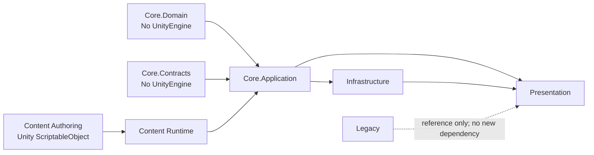
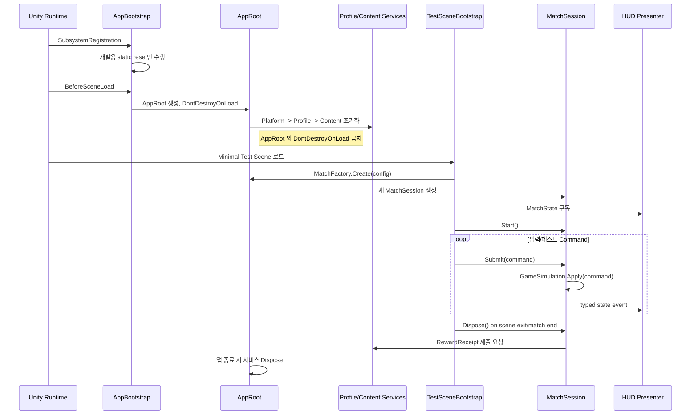
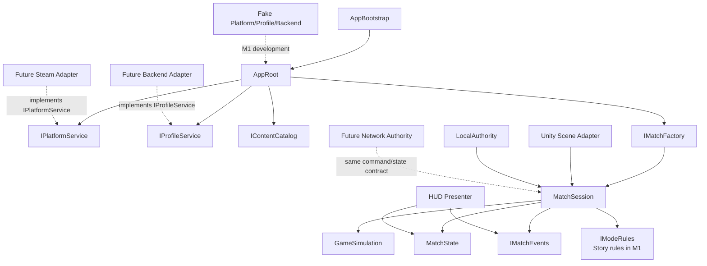
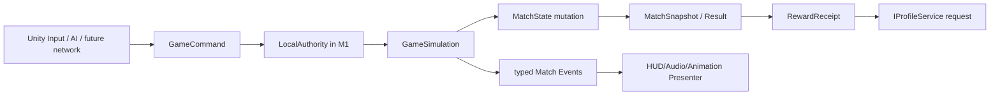

# Milestones and Milestone 1 Core Design

작성일: 2026-09-07
상태: 구현 전 설계 기준 / 로컬 논의용 (`Docs/`는 Git ignore)

## 0. 전제와 리팩터링 정책

이 프로젝트는 Unity 6 기반의 기존 콘텐츠를 유지하되, 기존 Manager 중심 실행 구조를
새 Core로 교체한다. 레거시는 기능·수치·연출의 레퍼런스이며 새 기능의 기반이 아니다.

계층과 타입 이름은 `naming-and-architecture-conventions.md`를 사용한다. 레거시 클래스와
목표 클래스의 대응은 `architecture-rebuild-notes.md`의 대응표를 따른다.

- 새 기능은 `GeneralManager`, `GameManager`, `DataManager`, `InGameManager`에 추가하지 않는다.
- 레거시 파일/씬은 prefab reference 보호를 위해 당장 이동·삭제하지 않는다.
- 새 Core는 레거시 static/Singleton에 의존하지 않는다.
- 전체 레거시 Play Mode 완주는 전환기의 성공 기준이 아니다.
- 새 기능 단위는 최소 Test Scene과 EditMode 테스트에서 독립 실행되어야 한다.

## 1. 제품/기술 기준

### 출시 및 장래 기능

- Steam 온라인 계정 기반 싱글플레이와 공유 Profile.
- 스토리 모드, 재화 획득 미니게임, 2인 협동.
- 협동은 친구 초대와 랜덤 매칭을 지원한다.
- 참가자 이탈은 재접속을 허용하고, 이후 Ally AI가 슬롯을 대체한다.
- Host 이탈 이후 매치 재개를 장래 요구사항으로 둔다.
- 백엔드가 재화·해금·연구의 최종 권한을 가진다. Local Binary는 캐시다.
- 채팅, 미니맵 Ping, SOS 구조 요청은 온라인 확장 기능이다.
- PvP는 Deferred이며, PvE 성장 스펙을 활용할 수 있도록 ModeRules를 분리한다.

### 목표 마일스톤

| 순서 | 마일스톤 | 핵심 결과 |
| --- | --- | --- |
| M1 | 핵심 기본 시스템 Core | 새 수명주기, Profile/Content/Match 경계, 테스트 가능한 싱글 Match 기반 |
| M2 | 싱글플레이 코어 루프 | 스토리 스테이지 1개를 새 Core로 완주: 전투·웨이브·보상·실패 보상·HUD |
| M3 | 온라인 협동 | Steam identity, Lobby, 2인 Match, 상태 복제, Human/AI slot 대체 |
| M4 | 온라인 확장 | 랜덤 매칭, SOS, 재접속, 채팅, Ping, Host Migration proof/도입, 리더보드 |
| M5 | 릴리스 | 저장/경제 검증 운영화, 밸런싱, QA, Steam 출시 준비 |

PvP는 M3~M5의 범위를 부풀리지 않는 별도 Deferred 트랙이다. PvP를 위해 필요한
Command/Authority/ModeRules 경계는 M1부터 반영하지만, PvP 게임 모드를 구현하지 않는다.

## 2. M1의 정확한 범위

M1은 Steam SDK, 실제 Backend, Netcode, 우주선 Hub, 전체 UI를 구현하는 단계가 아니다.
그들을 **나중에 붙일 수 있는 인터페이스와 수명주기**를 구현하는 단계다.

### M1에서 구현한다

- AppBootstrap과 App 수명주기.
- Content Catalog와 최소 ScriptableObject 정의값.
- Profile 도메인 모델, 로컬 versioned binary cache interface 및 fake/local 구현.
- Backend/Profile/Steam을 위한 Port(interface)와 개발용 fake 구현.
- `MatchSession`, immutable `MatchConfig`, `MatchState`, command/result/event 계약.
- `LocalAuthority`와 단일 스레드 `GameSimulation`.
- Player HP, Control Unit HP, Wave 상태, Match result, Reward receipt의 첫 vertical slice.
- UI가 상태를 구독하는 최소 HUD Presenter.
- Minimal Test Scene과 EditMode 테스트.

### M1에서 구현하지 않는다

- Steamworks SDK 또는 Steam 로그인 실제 연동.
- 실제 HTTP Backend/API, 인증 티켓, 운영 DB.
- Netcode for GameObjects, Relay, Lobby, 실제 랜덤 매칭.
- Host Migration, 채팅, Ping, SOS, PvP.
- 전체 우주선 Hub/다이아제틱 UI의 완성.
- 기존 모든 Manager/Stage의 교체.

M1은 향후 서비스의 **계약을 구현**하지만, 외부 SDK를 너무 일찍 의존성으로 넣지 않는다.

## 3. M1 성공 기준

1. Main, GeneralManager, GameManager, DataManager 없이 Minimal Test Scene이 실행된다.
2. App은 정확히 하나만 생성·파기되며, Match는 시작/종료 때마다 생성·파기된다.
3. Player/CU HP와 Wave 상태는 MatchState만 소유한다.
4. Unity UI는 PlayerInfo/ControlUnitStatus를 찾거나 폴링하지 않고 상태 변경을 구독한다.
5. 플레이어 행동은 Command로 Simulation에 전달되고, 직접 static 상태를 변경하지 않는다.
6. Match 완료/실패는 RewardReceipt를 만들며, Profile 반영은 `IProfileService` 계약을 통해서만 요청한다.
7. 외부 구현 없이 Fake Platform/Backend/Profile로 EditMode 테스트가 가능하다.
8. 새 코드에 `Find`, `*.Instance`, `GameManager` static, `GeneralManager` 참조가 없다.

## 4. 목표 폴더와 Assembly 방향

처음부터 모든 asmdef를 강제하지 않아도 되지만, 의존성 방향을 코드 구조로 고정하기 위해 M1 중에
Core와 Unity/외부 구현을 분리한 asmdef를 만든다.

```text
Assets/Scripts/
  Core/
    Domain/                # pure C#: IDs, values, Profile, MatchState, commands
    Application/           # use cases: MatchSession, GameSimulation, Profile flow
    Contracts/             # ports: IProfileService, IPlatformService, IEventBus
  Content/
    Authoring/             # ScriptableObject definitions; Unity-only authoring adapter
    Runtime/               # resolves definitions into immutable MatchConfig
  Infrastructure/
    Local/                 # binary cache, fake backend/platform implementations
    Steam/                 # later: Steamworks adapter only
    Backend/               # later: HTTP/API adapter only
    Network/               # later: NGO/transport adapter only
  Presentation/
    Bootstrap/             # AppBootstrap, composition roots
    Scene/                 # scene adapters, test scene bootstrap
    HUD/                   # HUD presenters/views
    GameplayAdapters/      # Player, Monster, Tower, Spawner adapters
  Legacy/                  # do not physically move existing files in M1
```

추천 namespace는 `TeamHjd.Game.Domain`, `Application`, `Contracts`, `Content`,
`Infrastructure`, `Presentation`이다. 폴더명과 namespace가 책임 경계를 드러내야 한다.

Assembly direction is one-way:



`Core.Domain` must compile in a normal .NET test project in principle. `Presentation` and
`Infrastructure` may reference Unity APIs; Domain and Application may not reference
`MonoBehaviour`, `GameObject`, `Transform`, `TMP_Text`, `SceneManager`, or Steam/Netcode SDK types.

## 5. M1 수명주기



### 수명주기 규칙

- `AppRoot`만 `DontDestroyOnLoad`를 사용한다.
- AppRoot는 오직 조립(composition)과 서비스 수명주기를 담당한다. 게임 규칙을 갖지 않는다.
- MatchSession은 씬 오브젝트가 아니며 plain C# `IDisposable` 객체다.
- MatchSession은 Match 종료 또는 씬 이탈 시 반드시 `Dispose`한다.
- View/Presenter는 `OnEnable`에서 구독하고 `OnDisable`에서 해제한다.
- Domain 이벤트 버스는 MatchSession 스코프다. 앱 전체 static EventBus를 만들지 않는다.

## 6. M1 의존성과 책임



### 책임표

| 구성요소 | 한다 | 하지 않는다 |
| --- | --- | --- |
| AppBootstrap | AppRoot 한 번 생성 | 게임 상태·씬별 Manager 보유 |
| AppRoot | 서비스 조립/Dispose | `Instance`를 통한 Service Locator 노출 |
| ContentCatalog | 정의값 조회와 버전 확인 | 플레이어 진행도/런타임 변경값 보유 |
| ProfileService | 검증된 Profile snapshot과 transaction 요청 | 전투 규칙 실행 |
| MatchSession | 한 매치의 시작/종료, command 진입점 | Unity UI/Prefab 제어 |
| GameSimulation | 규칙 적용, state 전이, 결과 생성 | Steam/HTTP/Unity API 호출 |
| MatchState | 현재 매치 상태 소유 | UI 직접 갱신 |
| Scene Adapter | Unity 입력/Prefab/Physics를 Command·View에 변환 | 경제/웨이브 권한 결정 |
| HUD Presenter | 상태를 화면에 표시 | 상태 직접 변경 |

## 7. 데이터 계약과 흐름

### 식별자와 불변 데이터

모든 외부/지속 데이터에는 primitive string 또는 Unity Object reference 대신 명시 ID를 사용한다.

```text
PlayerId, SteamId, MatchId, StageId, DefinitionId, EntityId, CurrencyId
ContentVersion, ProfileVersion, MatchConfigVersion
```

`MatchConfig`는 매치 시작 시 한 번 생성되어 바뀌지 않는다.

```text
MatchConfig
  matchId / mode / stage / difficulty / contentVersion
  player slots
  loadout snapshots
  resolved stat values
  random seed
```

이것이 싱글 재현, 협동 동기화, 재접속, Host Migration의 공통 입력이 된다.

### Command → State → Event 흐름



M1의 최소 command 예시는 다음과 같다.

```text
StartWaveCommand
ApplyPlayerDamageCommand        # test/combat adapter entry
ApplyControlUnitDamageCommand   # test/enemy adapter entry
ReportMonsterSpawnedCommand
ReportMonsterDefeatedCommand
EndMatchCommand                 # internal result transition only
```

M1에서는 command 검증과 결과를 명확히 하는 것이 목적이다. 네트워크 RPC, Unity Input,
충돌 콜백은 나중에 같은 command를 만드는 Adapter가 된다.

### 최소 상태와 이벤트

```text
MatchState
  MatchPhase: Preparing | Running | Cleared | Failed | Disposed
  WaveState: current, total, spawned, defeated
  PlayerState: id, hp, maxHp, alive
  ControlUnitState: hp, maxHp, power, maxPower
  MatchResult: none | clear | failed

Events
  PlayerHealthChanged
  ControlUnitHealthChanged
  WaveChanged
  MatchPhaseChanged
  MatchCompleted
```

State가 실제로 변경될 때만 이벤트를 한 번 발행한다. 매 FixedUpdate 폴링과 UnityEvent의
전역 연결은 새 Core에서 사용하지 않는다.

### Profile과 보상 흐름

```text
VerifiedProfileSnapshot
  -> ResolveLoadout(Profile + Content)
  -> MatchConfig
  -> MatchResult
  -> RewardReceipt (match id, content version, mode, result, reward basis)
  -> IProfileService.CommitRewardAsync(...)
  -> new VerifiedProfileSnapshot
  -> Local Binary Cache update
```

M1의 Fake ProfileService는 메모리/로컬 파일에서 동작할 수 있다. 실제 Backend는 같은
인터페이스를 구현하며, 서버가 receipt를 검증하고 최종 Profile version을 반환한다.

## 8. 외부 API와 종속성 정책

현재 `Packages/manifest.json`에는 Test Framework와 UGUI는 있으나 Steamworks, Netcode for
GameObjects, Relay/Matchmaker, Backend SDK는 없다. M1에서 이를 추가하지 않는다.

| 외부 대상 | M1 구현 | M3 이후 실제 Adapter |
| --- | --- | --- |
| Steam | `IPlatformService` + FakePlatformService | Steamworks adapter: identity, ownership, auth ticket |
| Backend | `IProfileService`/`IBackendGateway` + Fake | HTTP adapter: auth, profile, receipt, leaderboard |
| Network | `IAuthority`/`INetworkSession` 계약만 | NGO/transport adapter: command, snapshot, reconnect |
| Lobby/Matchmaking | 계약도 M1 범위 밖 | Steam Lobby 또는 선택한 matchmaking service |
| Binary cache | `IProfileCache`, local implementation | 동일 구현 유지; backend 원본과 동기화 |

외부 SDK의 타입은 `Infrastructure`에만 존재한다. `Core`의 public 계약에
`SteamId`, `NetworkObject`, `NetworkVariable`, `UnityWebRequest`를 직접 노출하지 않는다.

## 9. 상속보다 조합

M1에서 Manager 상속 계층을 만들지 않는다. 서비스는 interface + composition을 사용한다.

```text
good: MatchSession(GameSimulation, IMatchEvents, IModeRules, IClock)
bad:  BaseGameManager -> InGameManager -> CoopGameManager -> PvPGameManager
```

허용되는 작은 상속 범위는 Unity 표현 계층뿐이다.

```text
MonoBehaviour
  └─ SceneAdapterBase          # 선택: 구독/해제 공통 처리만
       ├─ PlayerSceneAdapter
       └─ ControlUnitSceneAdapter
```

AI도 상속 트리가 아니라 전략 조합을 사용한다.

```text
IPlayerAgent
  - HumanPlayerAgent
  - AllyBotAgent

IEnemyDecisionPolicy
  - AggressivePolicy
  - DefensivePolicy
```

모두 동일한 GameCommand를 만들며, Simulation을 우회하지 않는다.

## 10. M1 구현 순서와 검증

### 구현 단위

1. Core contracts, IDs, result/error 모델, AppBootstrap skeleton.
2. Content definitions와 resolved MatchConfig.
3. Profile snapshot/cache port와 Fake 구현.
4. MatchState + GameSimulation + typed events의 EditMode 테스트.
5. LocalAuthority + MatchSession lifecycle.
6. Minimal Test Scene + HUD Presenter.
7. RewardReceipt 생성 및 Fake Profile commit.

### 필수 테스트

- 웨이브 시작/몬스터 spawn/defeat가 올바른 MatchPhase로 전이한다.
- Player 또는 CU HP가 0이 되면 단 한 번 Failed result가 생성된다.
- 실패 보상과 클리어 보상은 ModeRules에서 계산된다.
- MatchConfig가 만들어진 뒤 Profile/Content 값 변경이 진행 중인 매치에 영향을 주지 않는다.
- MatchSession Dispose 후 구독자가 호출되지 않는다.
- Fake 외부 서비스 실패가 Simulation 상태를 손상시키지 않는다.
- Test Scene이 Legacy Manager를 생성하지 않는다.

## 11. M1 이후 이식 지도

M2에서 기존 코드의 기능을 새 Core로 이식할 때의 첫 매핑이다.

| 레거시 기능 | M1 기반 위의 새 위치 |
| --- | --- |
| `InGameManager.curWave`, spawn/die counters | MatchState + GameSimulation + StoryModeRules |
| `PlayerInfo` HP | PlayerState + PlayerSceneAdapter |
| `ControlUnitStatus` HP/Power | ControlUnitState + ControlUnitSceneAdapter |
| `UIPlayerHp`, `UICUInfo` | HUD Presenter/View |
| `DataManager` 업그레이드/코인 | Content definitions + Profile snapshot/Economy |
| `MonsterSpawner` 보고 | SpawnerSceneAdapter -> GameCommand |
| `Monster.Die` 보고 | MonsterSceneAdapter -> GameCommand |
| `SceneController` 게임 진입 | SceneFlow -> MatchFactory |

M1에 이 레거시 코드를 직접 수정해서 넣지 않는다. M2에서 Adapter를 작성해 기능을 하나씩
새 계약에 연결한다.
